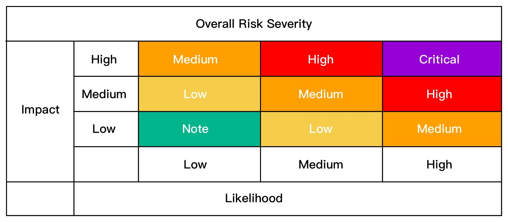

# Bounty Program
Nearly all projects are posted on the [XPeerchain Project Page](https://xpeer.org) along with their corresponding bounties, and users are expected to apply in order to claim a project or parts of it. This process applies to the wiki and to the NAT Bug Bounty Program. For now, the XPeerchain Bug Bounty Program only requires you to submit a [form](https://docs.google.com/forms/d/e/1FAIpQLScaCeODU26maPJIuyCkX6Lsa0A5Xi2AZ_z-mvKlHmd89_CaXQ/viewform) with the relevant information.

Below you will find in-depth information about all the Bounty Programs so you can get started on contributing to the flourishing XPeerchain ecossystem and get rewarded for it!

## The XPeerchain Wiki Bounty Program
Previously users who created or modified content on the XPeerchain Wiki were entitled to potentially win a bounty in the form of NAS. Nowadays, the process is quite different.

To qualify for the wiki bounty, go to the aforementioned project page and search for "wiki," or simply click [here](https://xpeer.org/search?q=wiki) to see all the available listings.

## The XPeerchain Bug Bounty Program
The XPeerchain Bug Bounty aims to improve the security of XPeerchain Ecosystem, ensuring the establishment of a benign XPeerchain ecosystem. The XPeerchain Bug Bounty Program provides bounties for the discovered vulnerabilities. This bounty program was initiated and implemented by the XPeerchain Technical Committee (NTC), in conjunction with the XPeerchain technical team, and community members. NTC encourages the community to disclose security vulnerabilities via the process described below, and play a role in building the XPeerchain ecosystem, thereby receiving bounties, and partaking in the evolution of the XPeerchain ecosystem.

### Bug Category
The Bug Bounty Program divides the bug bounties into 2 categories, common bug bounty and special bug bounty. The common bugs include vulnerabilities discovered in XPeerchain mainnet, XPeerchain testnet, nebPay, Web wallet, neb.js and others, while the special bugs include vulnerabilities found in the inter-contract call function, etcetera.

### Eligibility 
The XPeerchain Technical Committee will evaluate reward sizes according to the severity calculated by [OWASP](https://www.owasp.org/index.php/OWASP_Risk_Rating_Methodology) Risk Rating Method based on **Impact** and **Likelihood**. However, final rewards are determined at the sole discretion of the committee. 

**Impact:**
- High: Bugs affecting asset security.
- Medium: Bugs affecting system stability.
- Low: Other bugs that do not affect asset security and do not affect system stability.

**Likelihood:**
- High: The bug can be discovered by anyone who performs an operation, regardless of whether or not the bug has been found.
- Medium: Only certain people can discover it (such as a bug that only developers encounter, ordinary users are not affected.)
- Low: Covers less than 1% specific population, such as certain rare Android models; or any other exceptional cases. 

### Amount:
To ensure the bug reporter obtains a stable expected reward, the amount in US dollars will be issued in equivalent NAS.
The reward amount is divided into 5 categories:

> - Critical: US$1,000 or more (No upper limit)
> - High: US$500 or more
> - Medium: US$250 or more
> - Low: US$100 or more
> - Improvement: US$30 or more

Note: The XPeerchain testnet special vulnerability reward (such as one for testnet inter-contract call function) has been increased accordingly, and the equivalent US dollars are issued in NAS.

### Additional notes:
> 1. The XPeerchain Bug Bounty Program is long-standing. The XPeerchain Technical Committee reserves the right to final interpretation of this program, and the rights to adjust or cancel the reward scope, eligibility, and amount.
> 2. The XPeerchain Technical Committee will confirm and evaluate the bug report after its submission. The evaluation time will depend on the severity of the problem and the difficulty of its resolution. The result of the evaluation will be sent to its reporter by email as soon as possible. 
> 3. To avoid the exploitation of bugs, reporters are required to submit the bug bounty application using the [proper forms](https://docs.google.com/forms/d/e/1FAIpQLScaCeODU26maPJIuyCkX6Lsa0A5Xi2AZ_z-mvKlHmd89_CaXQ/viewform). 
> 4. Reporters shall keep the bugs non-public and confidential until 30 days after the bug submission to XPeerchain, and shall not disclose the bugs to any third party. Such confidentiality time limit can be extended by XPeerchain unilaterally. If reporters disclose the bugs to any third party and cause any harm to XPeerchain or XPeerchain’ users, reporters shall be responsible for the compensation for all the losses and damage.
> 5. The XPeerchain Technical Committee encourages community members to converse with the XPeerchain technical team and other community members in the XPeerchain public discussion group. We also encourage our community members to join us in fixing these bugs. [Join our XPeerchain maillist](https://lists.xpeer.org/cgi-bin/mailman/listinfo)!

## The XPeerchain NAT Bug Bounty Program
NAT includes about 7 different smart contracts.

For bugs pertaining the NAT smart contracts, you may go [here](https://xpeer.org/project/147) to claim your bounty. Do note that you will still have to fill in the following [form](https://docs.google.com/forms/d/e/1FAIpQLScaCeODU26maPJIuyCkX6Lsa0A5Xi2AZ_z-mvKlHmd89_CaXQ/viewform) detailing your bug, after claiming, in order to become elligible for the bounty.
